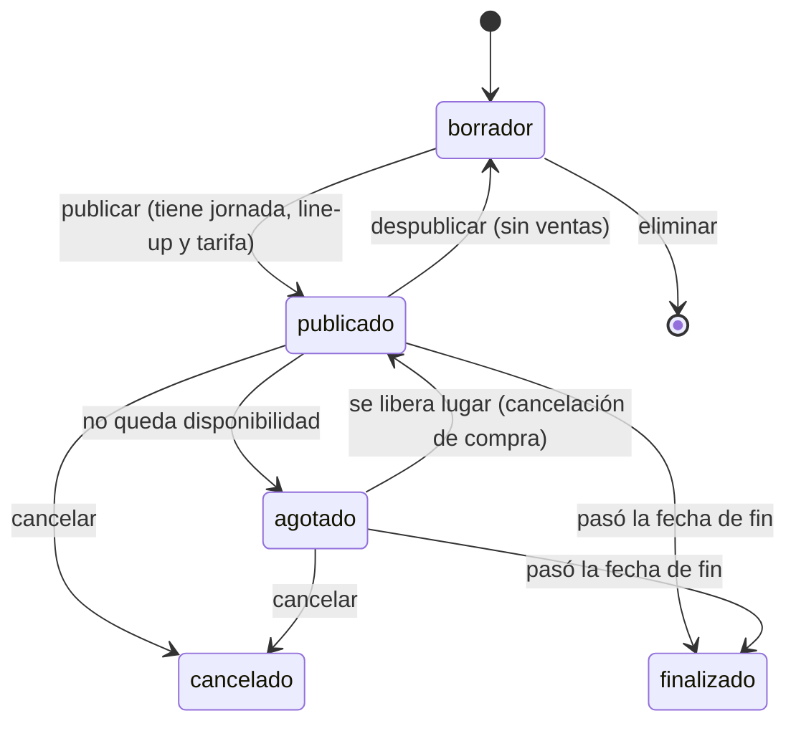
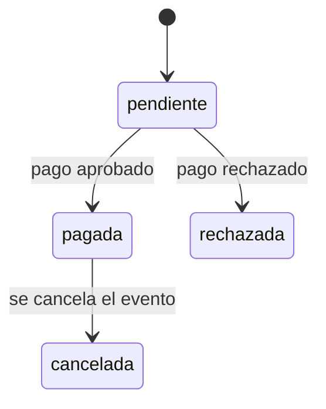
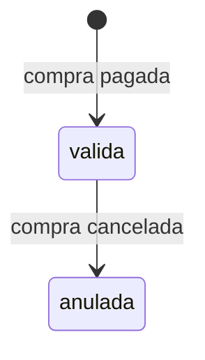

# Backstage — Dominio del negocio

Descripción completa de la empresa **Backstage**: qué hace, quiénes participan, cómo gana plata, qué procesos tiene y qué reglas cumple.
Es la base común para todas las materias del proyecto. El modelo de datos que lo implementa está en [der/DER.md](der/DER.md), y el plan técnico en [PLAN.md](PLAN.md).

> Backstage es una empresa **ficticia**, creada para el proyecto intermaterias. Los pagos son simulados.
> Las reglas marcadas con *(propuesta)* son decisiones nuestras que todavía se pueden ajustar.

---

## 1. La empresa

**Backstage** es una plataforma web (SaaS) para **productoras de recitales y festivales**.
Una productora se registra y, desde un panel, carga sus artistas, elige o carga el lugar del show, arma el evento
(fechas, escenarios, line-up y precios por sector) y lo publica. El público compra las entradas en la cartelera de Backstage,
y Backstage cobra por cada venta un **service charge**.

### 1.1 Problema que resuelve
- Las productoras chicas y medianas organizan los eventos con planillas, mensajes y una ticketera aparte. No tienen una herramienta que una
  la **producción** (line-up, escenarios, horarios) con la **venta** (sectores, precios, cupos).
- Armar un festival de varios días y escenarios genera errores fáciles: un artista en dos escenarios a la misma hora, dos bandas superpuestas
  en el mismo escenario, o más entradas vendidas que la capacidad del sector.
- El público tiene que ir a buscar cada evento a la web de cada productora.

### 1.2 Propuesta de valor
| Para | Backstage ofrece |
| --- | --- |
| **Productoras** | Un panel único para producir y vender: catálogo de lugares listo para usar, armado del line-up con control automático de superposiciones, precios por sector, ventas en tiempo real y control de acceso con QR. Sin costo de alta *(propuesta)* |
| **Público** | Una cartelera con los eventos de todas las productoras, el line-up por día y escenario, compra eligiendo el sector en el plano del lugar, y las entradas en el celular |
| **Backstage** | Un ingreso por cada entrada vendida, sin hacerse cargo de producir los eventos |

### 1.3 Misión, visión y objetivos
- **Misión:** darles a las productoras de música en vivo una herramienta simple para producir y vender sus eventos en un solo lugar.
- **Visión:** ser la plataforma de referencia de recitales y festivales en Argentina, para productoras y para el público.
- **Objetivos del primer año** *(propuesta)*:
  1. Sumar 20 productoras activas.
  2. Ofrecer al menos 20 lugares precargados en el catálogo.
  3. Que el 100 % de las ventas pasen por la pasarela de Backstage, con su service charge.
  4. Que no haya ninguna sobreventa: ninguna entrada vendida por encima de la capacidad de un sector.

---

## 2. Actores

| Actor | Tipo | Descripción | ¿Usa el sistema? |
| --- | --- | --- | --- |
| **Equipo Backstage** (superadmin) | Interno | Dueños de la plataforma. Dan de alta productoras, mantienen el catálogo de lugares, fijan el service charge y controlan la actividad | Sí: panel `/admin` |
| **Productora** (empresa) | Cliente B2B, *tenant* | Organiza eventos. Carga sus artistas y sus lugares propios, arma los eventos y maneja sus entradas | Sí: panel `/panel` |
| **Cliente** (público) | Cliente B2C | Persona que compra entradas | Sí: cartelera y "mis entradas" |
| **Visitante** | Externo | Persona que mira la cartelera sin cuenta | Sí: solo lectura |
| **Artista** | Externo | Banda o solista que contrata la productora | **No**: es un dato que carga la productora |
| **Lugar** (estadio, teatro, predio) | Externo | Espacio físico donde se hace el evento | **No**: es un dato del catálogo o de la productora |
| **Pasarela de pago** | Sistema externo | Procesa el pago. En este proyecto es **simulada** | Integración |

---

## 3. Modelo de negocio

### 3.1 Cómo se reparte la plata
- La **productora** fija el precio de cada entrada y cobra el **subtotal** (la suma de los precios).
- **Backstage** cobra un **service charge**: un porcentaje sobre el subtotal que **paga el cliente**, aparte del precio.
  El porcentaje lo fija Backstage para cada productora (por defecto **10 %**), así se pueden negociar condiciones distintas.
- La pasarela de pago es de Backstage: el cliente paga el total, Backstage retiene el service charge y liquida el subtotal a la productora.
  En el proyecto la liquidación se ve como un reporte; no se mueve plata real.

### 3.2 Ejemplo
Un cliente compra 2 entradas de **Campo** a $50.000 cada una, para un recital de una productora con service charge del 10 %:

| Concepto | Importe | Para |
| --- | ---: | --- |
| Subtotal (2 × $50.000) | $100.000 | Productora |
| Service charge (10 %) | $10.000 | Backstage |
| **Total que paga el cliente** | **$110.000** | |

El porcentaje queda guardado en la compra. Si después Backstage le cambia el % a esa productora, las compras anteriores no cambian.

### 3.3 Qué no cobra Backstage *(propuesta)*
- No hay abono mensual ni costo de alta para las productoras.
- No se cobra por publicar eventos ni por cargar lugares.

---

## 4. Conceptos del dominio (glosario)

| Término | Definición |
| --- | --- |
| **Productora** | Empresa que organiza eventos. Es el *tenant*: sus datos son privados frente a las otras productoras |
| **Lugar** | Espacio físico donde se hace un evento (estadio, arena, teatro, predio, club) |
| **Lugar de la plataforma** | Lugar cargado por Backstage. Lo pueden usar todas las productoras, pero ninguna lo puede editar |
| **Lugar propio** | Lugar cargado por una productora. Solo ella lo ve y lo usa |
| **Escenario** | Tarima física dentro de un lugar donde tocan los artistas. Un lugar puede tener varios |
| **Espacio / Sector** | Parte del lugar donde se ubica el público (Campo, Platea, VIP). Tiene una **capacidad** |
| **Capacidad** | Cantidad máxima de personas en un sector. La carga quien registra el lugar y es el **cupo** de entradas de ese sector |
| **Plano** | Dibujo del lugar con sus sectores, escenarios y elementos de referencia. Es opcional |
| **Elemento del plano** | Algo que se ve en el plano pero no se vende: cabina de DJ, barra, baños, ingreso, mangrullo |
| **Artista** | Banda o solista. Lo carga la productora que lo trae |
| **Evento** | Un **recital** (un artista principal, normalmente un día) o un **festival** (muchos artistas, uno o varios días), en un lugar |
| **Jornada** | Cada día de un evento. Un recital tiene una; un festival, varias |
| **Escenario habilitado** | Escenario del lugar que se usa en un evento determinado |
| **Presentación** | Un show: un artista, en una jornada, en un escenario habilitado, con horario de inicio y fin |
| **Line-up** | El conjunto de presentaciones de un evento, organizado por jornada y escenario |
| **Headliner** | Artista principal de una jornada |
| **Tarifa** | Precio de un sector para una jornada (entrada por día) o para todo el evento (abono). Ej.: "Preventa 1", "General" |
| **Abono** | Entrada válida para todas las jornadas de un festival |
| **Disponibilidad** | Entradas que quedan en un sector para una jornada: capacidad − entradas válidas vendidas. Los abonos ocupan lugar en todas las jornadas |
| **Compra** | Operación en la que un cliente paga una o más entradas de un evento |
| **Service charge** | Cargo que cobra Backstage sobre el subtotal de cada compra |
| **Entrada** | Comprobante de acceso de una persona a un sector, con un código único (QR) |
| **Ingreso** | Registro de que una entrada pasó por la puerta en una jornada. Una entrada de un día tiene como máximo uno; un abono, uno por jornada |
| **Control de acceso** | Validación del QR en la puerta, que registra el ingreso |

---

## 5. Procesos de negocio

### P1. Alta de una productora
1. La productora contacta a Backstage *(propuesta: el alta la hace el equipo, no hay autoregistro de productoras)*.
2. El superadmin carga la productora (razón social, CUIT, contacto) y su porcentaje de service charge.
3. El superadmin crea los usuarios de la productora, que reciben su email y contraseña.
4. La productora ya puede entrar a su panel.

### P2. Carga de un lugar
- **De la plataforma:** el superadmin carga el lugar, sus escenarios y sus sectores con capacidad y, opcionalmente, dibuja el plano.
  Queda disponible para todas las productoras.
- **Propio:** una productora que hace eventos en un lugar que no está en el catálogo lo carga ella misma, con los mismos datos.
  Si no quiere dividirlo en sectores, carga una sola capacidad y el sistema crea el sector "General".

### P3. Armado de un evento
1. **Datos:** nombre, tipo (recital o festival), lugar (de la plataforma o propio), fechas de inicio y fin.
2. **Jornadas:** se generan a partir de las fechas, una por día, con su hora de apertura.
3. **Escenarios:** la productora elige cuáles escenarios del lugar va a usar.
4. **Line-up:** para cada jornada y escenario carga las presentaciones (artista, horario, si es headliner).
   El sistema rechaza superposiciones en el mismo escenario, y que un artista esté en dos shows a la vez.
5. **Tarifas:** para cada sector define los precios, por jornada o como abono, con su período de venta.
6. El evento queda en **borrador** hasta que se publica.

### P4. Publicación
1. La productora publica el evento.
2. El sistema verifica que tenga al menos una jornada, una presentación y una tarifa.
3. El evento pasa a **publicado** y aparece en la cartelera.

### P5. Compra de entradas
1. El cliente entra a la cartelera y abre un evento: ve el line-up por día y escenario, y los sectores con precio y disponibilidad.
2. Elige jornada o abono, sector (en el plano o en una lista) y cantidad.
3. El sistema muestra el resumen: subtotal + service charge = total.
4. El cliente inicia sesión (o se registra) y paga con una tarjeta ficticia.
5. En una sola operación, el sistema verifica que siga habiendo lugar, simula el pago y, si se aprueba, registra la compra y emite las entradas con su QR.
6. Si el pago se rechaza, no se emite nada y el lugar no queda reservado.
7. El cliente ve sus entradas en "Mis entradas".

### P6. Control de acceso
1. El día del evento, el personal de la productora escanea o ingresa el código de la entrada.
2. Si la entrada es **válida**, corresponde a ese evento y es para esa jornada (o es un abono), se registra el **ingreso** con fecha y hora.
3. Se rechaza si la entrada está anulada, si es de otra jornada o si ya tiene un ingreso en esa jornada.
   Así, una entrada de un día entra una sola vez, y un abono entra una vez por cada jornada *(RN-24)*.

### P7. Cancelación de un evento *(propuesta)*
1. La productora (o el superadmin) cancela el evento.
2. Las compras pagadas pasan a **cancelada** y sus entradas a **anulada**. El reintegro al cliente (total, con service charge incluido) es simulado.
3. El evento queda visible como "Cancelado" en la cartelera.

### P8. Seguimiento y liquidación
- **Productora:** ve las ventas por evento, jornada, sector y tarifa, y el subtotal a cobrar.
- **Superadmin:** ve la recaudación por service charge por productora y por mes, la cantidad de eventos por estado y las entradas vendidas.

---

## 6. Ciclos de vida

### 6.1 Evento

### 6.2 Compra

### 6.3 Entrada

"Usada" no es un estado de la entrada: se sabe por sus **ingresos**. Así un abono puede entrar en cada jornada sin cambiar de estado.
Una entrada anulada no puede registrar ingresos.

---

## 7. Reglas de negocio

**Productoras y usuarios**
- **RN-01** Cada productora ve y modifica solo sus propios datos: artistas, lugares propios, eventos, ventas.
- **RN-02** El CUIT de una productora es único en la plataforma.
- **RN-03** Un usuario de una productora pertenece a una sola productora. El superadmin y los clientes no pertenecen a ninguna.
- **RN-04** Las productoras no se borran: se dan de baja, y sus datos históricos se conservan.
- **RN-05** El service charge de cada productora es un porcentaje entre 0 y 100, lo fija solo el superadmin y por defecto vale 10 %.

**Lugares**
- **RN-06** Los lugares de la plataforma los pueden usar todas las productoras y solo los edita el superadmin.
- **RN-07** Los lugares propios de una productora no son visibles para las demás.
- **RN-08** Todo lugar tiene al menos un sector, y cada sector tiene una capacidad mayor que cero.
- **RN-09** La capacidad total de un lugar es la suma de las capacidades de sus sectores.
- **RN-10** Un lugar puede tener cualquier cantidad de escenarios, incluso ninguno (un teatro sin escenarios diferenciados se carga con uno).
- **RN-11** No se puede borrar un lugar que tiene eventos, ni un sector o escenario que se está usando.

**Artistas y line-up**
- **RN-12** Cada productora carga sus propios artistas y solo puede programar artistas propios.
- **RN-13** Un artista puede tener varias presentaciones en el mismo evento: en distintas jornadas, o en la misma jornada en distintos escenarios.
- **RN-14** Un artista no puede tener dos presentaciones que se superpongan en el tiempo.
- **RN-15** Un escenario no puede tener dos presentaciones que se superpongan en el tiempo.
- **RN-16** Una presentación solo puede ser en un escenario que el evento habilitó, y ese escenario tiene que ser del lugar del evento.
- **RN-17** Una presentación empieza el día de su jornada o en la madrugada del día siguiente, y termina después de empezar.

**Eventos**
- **RN-18** Un evento se hace en un solo lugar, que tiene que ser de la plataforma o propio de la productora.
- **RN-19** La fecha de fin de un evento no puede ser anterior a la de inicio, y cada jornada cae dentro de ese rango, sin repetir fecha.
- **RN-20** Para publicar un evento hace falta al menos una jornada, una presentación y una tarifa.
- **RN-21** No se puede cambiar el lugar de un evento que ya tiene escenarios habilitados o tarifas. Un evento con ventas no se borra: se cancela.

**Entradas y ventas**
- **RN-22** El cupo de un sector es su capacidad. La productora no define cupos: solo precios.
- **RN-23** No se pueden vender más entradas de las que entran en un sector para una jornada. Los abonos ocupan lugar en todas las jornadas.
- **RN-24** Una entrada de jornada habilita un solo ingreso, en su jornada. Un abono habilita un ingreso por cada jornada del evento.
- **RN-25** Una tarifa solo se vende dentro de su período de venta y mientras esté activa.
- **RN-26** Solo los usuarios con rol cliente pueden comprar. Una compra es de un solo evento.
- **RN-27** Total = subtotal + service charge, y service charge = subtotal × % de la productora. El % queda registrado en la compra.
- **RN-28** El precio de cada entrada queda registrado al momento de la compra: si después cambia la tarifa, la entrada no cambia.
- **RN-29** Cada entrada tiene un código único que no se puede adivinar (UUID), y se muestra como QR.
- **RN-30** Máximo 10 entradas por compra *(propuesta)*.

---

## 8. Casos de uso por actor

| Actor | Casos de uso |
| --- | --- |
| **Superadmin** | Iniciar sesión · ABM de productoras (incluye el % de service charge) · ABM de usuarios de productoras · ABM de lugares de la plataforma (escenarios, sectores, plano) · Ver todos los eventos · Despublicar o cancelar un evento · Ver métricas y recaudación |
| **Productora** | Iniciar sesión · Editar los datos de la productora · ABM de artistas · Ver el catálogo de lugares · ABM de lugares propios (escenarios, sectores, plano) · Crear evento · Cargar jornadas · Habilitar escenarios · Armar el line-up · Definir tarifas · Publicar o cancelar el evento · Ver ventas · Validar entradas |
| **Cliente** | Registrarse · Iniciar sesión · Ver la cartelera · Ver el detalle de un evento · Comprar entradas · Ver mis compras y entradas · Editar el perfil |
| **Visitante** | Ver la cartelera · Ver el detalle de un evento · Registrarse |

---

## 9. Indicadores (KPIs)

| Indicador | Cálculo | Lo ve |
| --- | --- | --- |
| Recaudación por service charge | Σ cargo_servicio de las compras pagadas, por mes y por productora | Superadmin |
| Productoras activas | Productoras con al menos un evento publicado en el período | Superadmin |
| Entradas vendidas | Cantidad de entradas válidas de compras pagadas | Ambos |
| Ocupación | Entradas vendidas ÷ capacidad, por evento, jornada y sector | Productora |
| Ventas por tarifa | Entradas y subtotal por tarifa (para comparar Preventa con General) | Productora |
| Tasa de asistencia | Ingresos ÷ entradas vendidas, por jornada | Productora |
| Tasa de rechazo de pagos | Compras rechazadas ÷ compras iniciadas | Superadmin |

---

## 10. Alcance

**Incluido**
- Gestión multiempresa: cada productora con sus datos aislados.
- Catálogo de lugares de la plataforma y lugares propios, con escenarios, sectores y plano opcional.
- Eventos de uno o varios días, varios escenarios, line-up con control de superposición.
- Precios por sector, entradas por día y abonos.
- Venta con service charge y pago simulado; entradas con QR y control de acceso.
- Reportes de ventas y de recaudación.

**Fuera de alcance**
- Pagos reales, facturación electrónica y liquidación bancaria.
- Asientos numerados: se vende por sector, no por butaca.
- Reventa o transferencia de entradas entre clientes.
- Sub-roles dentro de la productora (administrador, boletería): hay un solo tipo de usuario por productora.
- Login para artistas o lugares.
- App móvil nativa: es web responsive.
- Varias monedas: todo en pesos argentinos.

---

## 11. Supuestos
- Todos los eventos son en Argentina y en una misma zona horaria.
- La productora es responsable del evento (contratos con artistas y lugares). Backstage solo provee la herramienta y la venta.
- La capacidad que se carga en cada sector es la habilitada para la venta (ya descontadas invitaciones o zonas técnicas).
- El catálogo inicial tiene 20 lugares reales de Argentina (Kempes, Movistar Arena, Luna Park, etc.), cargados con fines académicos.
