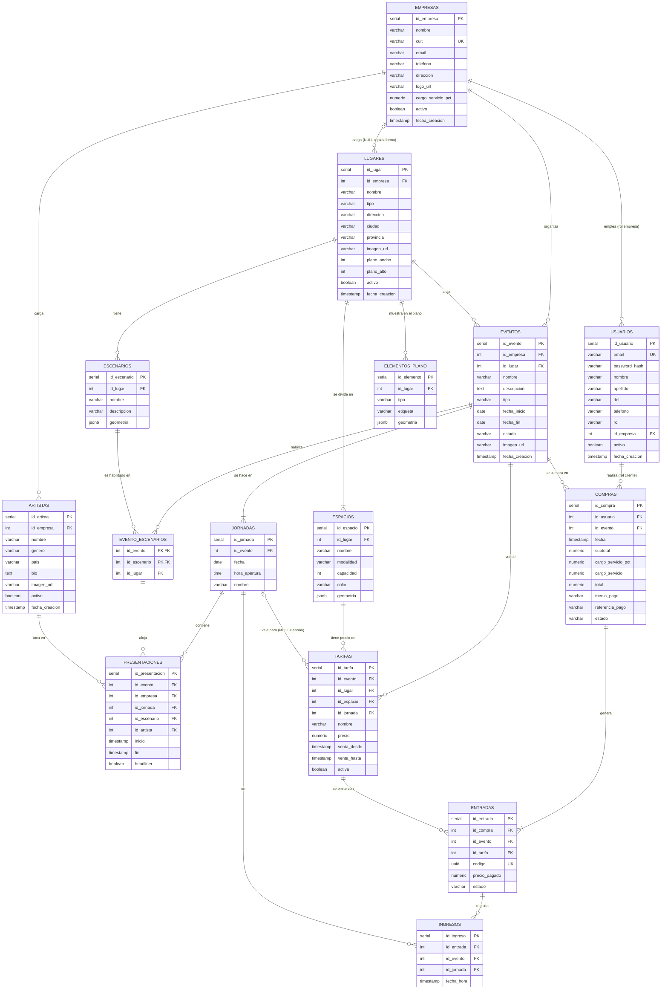

# Backstage — Diagrama Entidad-Relación

Modelo de datos de la plataforma. Es la fuente de verdad para los scripts SQL, la API y las materias que usen el DER.

| Archivo | Para qué |
| --- | --- |
| [`backstage.dbml`](backstage.dbml) | Modelo lógico completo (tipos, claves, índices, FK compuestas). Pegarlo en **[dbdiagram.io](https://dbdiagram.io/d)** para ver el diagrama y exportarlo a PNG o PDF |
| este documento | Explicación: entidades, relaciones, restricciones, reglas de borrado y normalización |

Motor: **PostgreSQL 15+** (Supabase). Usa `UNIQUE NULLS NOT DISTINCT` (PG 15) y las extensiones `btree_gist` y `pgcrypto`.

---

## 1. Diagrama

> Mermaid no dibuja las FK compuestas. En el diagrama de dbdiagram.io (`backstage.dbml`) se ven completas.

---

## 2. Entidades

| Entidad | Qué representa | Quién la carga |
| --- | --- | --- |
| **empresas** | Productora de eventos: el *tenant* de la plataforma | superadmin |
| **usuarios** | Cualquier persona con login. El `rol` define si es superadmin, personal de una productora o cliente | superadmin (empresa), autoregistro (cliente) |
| **lugares** | Estadio, teatro, predio, club. Si `id_empresa` está vacío es de la plataforma; si no, es privado de una productora | superadmin o productora |
| **escenarios** | Escenario físico de un lugar (Principal, Alternativo, Carpa electrónica…) | quien cargó el lugar |
| **espacios** | Sector vendible del lugar (Platea, Campo, VIP). Su `capacidad` es el cupo | quien cargó el lugar |
| **elementos_plano** | Referencias del plano que no se venden (cabina de DJ, barras, baños, ingresos) | quien cargó el lugar |
| **artistas** | Artista o banda que trae una productora | productora |
| **eventos** | Recital o festival de una productora en un lugar | productora |
| **jornadas** | Cada día del evento (un recital tiene 1, un festival varias) | productora |
| **evento_escenarios** | Escenarios del lugar que el evento usa | productora |
| **presentaciones** | Un show: un artista en una jornada, en un escenario, con horario | productora |
| **tarifas** | Precio de un sector para una jornada o para el abono | productora |
| **compras** | Operación de pago (simulado) de un cliente, con el service charge | cliente |
| **entradas** | Cada entrada emitida en una compra, con su código QR | sistema (al pagar) |
| **ingresos** | Cada vez que una entrada entra por la puerta en una jornada (control de acceso) | productora (al escanear) |

---

## 3. Relaciones y cardinalidades

| Relación | Cardinalidad | Lectura |
| --- | --- | --- |
| empresas — usuarios | 1 : 0..N | Una productora tiene muchos usuarios. Un usuario de rol `empresa` pertenece a exactamente una; superadmin y cliente, a ninguna |
| empresas — lugares | 0..1 : 0..N | Un lugar es de una productora (privado) o de ninguna (de la plataforma) |
| empresas — artistas | 1 : 0..N | Cada artista pertenece a una productora |
| empresas — eventos | 1 : 0..N | Cada evento lo organiza una productora |
| lugares — escenarios | 1 : 0..N | Un lugar tiene los escenarios que sean (3, 4, 8…) |
| lugares — espacios | 1 : **1**..N | Todo lugar tiene al menos un sector ("General" si no se sectoriza) |
| lugares — elementos_plano | 1 : 0..N | Solo si el lugar tiene plano |
| lugares — eventos | 1 : 0..N | Un evento se hace en un solo lugar |
| eventos — jornadas | 1 : 1..N | Para publicar, un evento necesita al menos una jornada |
| eventos — escenarios | N : M | Se resuelve con **evento_escenarios**: un evento habilita algunos escenarios de su lugar, y un escenario se usa en muchos eventos |
| artistas — eventos | N : M | Se resuelve con **presentaciones**, que además relaciona la jornada y el escenario. Es una relación ternaria: artista × jornada × escenario habilitado |
| eventos / espacios / jornadas — tarifas | 1 : 0..N cada una | Una tarifa es de un evento, de un sector y de una jornada (o de ninguna = abono) |
| usuarios — compras | 1 : 0..N | Solo usuarios de rol `cliente` |
| eventos — compras | 1 : 0..N | Una compra es de un solo evento |
| compras — entradas | 1 : 1..N | Una compra genera una o más entradas |
| tarifas — entradas | 1 : 0..N | Cada entrada se emite con una tarifa |
| entradas — ingresos | 1 : 0..N | Una entrada de un día tiene como máximo 1 ingreso; un abono, 1 por jornada |
| jornadas — ingresos | 1 : 0..N | Cada ingreso es en una jornada |

### 3.1 Casos del dominio y cómo se resuelven

| Caso | Solución en el modelo |
| --- | --- |
| Un artista toca **varias fechas** del mismo festival | Varias filas en `presentaciones` con distinta `id_jornada` |
| Un artista toca **dos veces el mismo día** en dos escenarios | Dos filas en `presentaciones`: misma jornada, distinto escenario y horario |
| Un artista **no** puede estar en dos shows a la vez | `EXCLUDE USING gist (id_artista WITH =, tsrange(inicio, fin) WITH &&)` |
| Un escenario **no** puede tener dos shows superpuestos | `EXCLUDE USING gist (id_escenario WITH =, tsrange(inicio, fin) WITH &&)` |
| El show es en un escenario **habilitado** para el evento | FK `(id_evento, id_escenario)` → `evento_escenarios` |
| El escenario habilitado es **del lugar del evento** | `evento_escenarios` lleva `id_lugar`, con FK `(id_evento, id_lugar)` → `eventos` y `(id_escenario, id_lugar)` → `escenarios` |
| El artista es **de la productora del evento** | `presentaciones` lleva `id_empresa`, con FK `(id_evento, id_empresa)` → `eventos` y `(id_artista, id_empresa)` → `artistas` |
| La tarifa es de un sector **del lugar del evento** | `tarifas` lleva `id_lugar`, con FK `(id_evento, id_lugar)` → `eventos` y `(id_espacio, id_lugar)` → `espacios` |
| La entrada es de una tarifa **del mismo evento que la compra** | `entradas` lleva `id_evento`, con FK `(id_compra, id_evento)` → `compras` y `(id_tarifa, id_evento)` → `tarifas` |
| La jornada de la presentación o de la tarifa es **del mismo evento** | FK `(id_jornada, id_evento)` → `jornadas` |
| Entrada por día o **abono** | `tarifas.id_jornada` con valor = un día; `NULL` = abono de todas las jornadas |
| El **cupo** de un sector | `espacios.capacidad`. Varias tarifas del mismo sector comparten ese cupo |
| La productora usa lugares **de la plataforma o propios** | Trigger en `eventos` (una FK no alcanza porque `id_empresa` del lugar puede ser NULL) |
| Un **abono** entra una vez **por día**, una entrada común una sola vez | Tabla `ingresos` con `UNIQUE (id_entrada, id_jornada)` y trigger que exige que la entrada de un día solo ingrese en su jornada |
| Service charge con historial | `compras` guarda el `%` aplicado y los importes: si después cambia el % de la productora, las compras viejas no cambian |

---

## 4. Restricciones de integridad

### 4.1 Claves
- **PK** simples `serial` en todas las tablas, salvo `evento_escenarios`, que tiene la compuesta `(id_evento, id_escenario)`.
- **Claves alternativas (UNIQUE):** `empresas.cuit`, `usuarios.email`, `entradas.codigo`, más las de nombre por dueño:
  `lugares (id_empresa, nombre)` con NULLS NOT DISTINCT, `escenarios (id_lugar, nombre)`, `espacios (id_lugar, nombre)`, `artistas (id_empresa, nombre)`,
  `jornadas (id_evento, fecha)` y `tarifas (id_evento, id_espacio, id_jornada, nombre)` con NULLS NOT DISTINCT.
- **UNIQUE técnicas** `(id_x, id_y)`: existen solo para que una FK compuesta pueda apuntarles. Están marcadas en el `.dbml`.

### 4.2 CHECK
| Tabla | Regla |
| --- | --- |
| empresas | `cargo_servicio_pct BETWEEN 0 AND 100` |
| usuarios | `rol IN ('superadmin','empresa','cliente')` y `(rol = 'empresa') = (id_empresa IS NOT NULL)` |
| lugares | `tipo IN (...)`; `plano_ancho` y `plano_alto` ambos NULL o ambos > 0 |
| espacios | `capacidad > 0`, `modalidad IN ('de_pie','sentado')` |
| elementos_plano | `tipo IN (...)` |
| eventos | `fecha_fin >= fecha_inicio`, `tipo IN ('recital','festival')`, `estado IN (...)` |
| presentaciones | `fin > inicio` (más los dos `EXCLUDE`) |
| tarifas | `precio >= 0`, `venta_hasta > venta_desde` |
| compras | `total = subtotal + cargo_servicio`, `medio_pago IN (...)`, `estado IN (...)` |
| entradas | `estado IN ('valida','anulada')`. Si una entrada "fue usada" se sabe por `ingresos`, no se guarda en la entrada |
| geometrías (jsonb) | `geometria ? 'tipo'`. La forma completa la valida el backend |

### 4.3 Triggers (lo que no se puede expresar con FK ni CHECK)
| Trigger | Regla |
| --- | --- |
| `eventos_lugar_valido` | El lugar del evento es de la plataforma (`id_empresa IS NULL`) o de la misma productora |
| `jornadas_en_rango` | La fecha de la jornada está entre `fecha_inicio` y `fecha_fin` del evento. Si cambian las fechas del evento, se vuelve a verificar |
| `presentacion_en_jornada` | `inicio` cae el día de la jornada o en la madrugada del siguiente (shows después de medianoche) |
| `espacios_minimo_uno` | No se puede borrar el último espacio de un lugar, salvo que se esté borrando el lugar entero |
| `compras_solo_clientes` | `compras.id_usuario` tiene que tener rol `cliente` |
| `ingresos_validos` | La entrada está `valida`, y si su tarifa es de un día, el ingreso es en esa jornada |

### 4.4 Lo que valida el backend
- Que no se venda por encima de la capacidad: al comprar, en una transacción con `SELECT … FOR UPDATE` sobre las tarifas del evento y el espacio.
- La forma completa de las geometrías (con zod).
- Que para publicar un evento haya al menos 1 jornada, 1 presentación y 1 tarifa.

---

## 5. Reglas de borrado

| Desde → hacia | Acción | Por qué |
| --- | --- | --- |
| empresas → usuarios, lugares, artistas, eventos | RESTRICT | Una productora no se borra: se da de baja (`activo = false`) |
| lugares → escenarios, espacios, elementos_plano | CASCADE | Son partes del lugar |
| lugares → eventos | RESTRICT | No se borra un lugar que tiene eventos |
| eventos → jornadas, evento_escenarios, presentaciones, tarifas | CASCADE | Un evento borrador se borra completo |
| eventos → compras | RESTRICT | Un evento con ventas no se borra: se cancela |
| escenarios → evento_escenarios / espacios → tarifas | RESTRICT | No se borra un escenario o un sector que se está usando |
| artistas → presentaciones | RESTRICT | Baja lógica (`activo = false`) |
| compras → entradas | CASCADE | Las entradas son parte de la compra |
| entradas → ingresos | CASCADE | Los ingresos son parte de la entrada |
| jornadas → ingresos | RESTRICT | No se borra una jornada en la que ya entró gente |
| tarifas → entradas | RESTRICT | No se borra una tarifa con entradas vendidas |

`ON UPDATE CASCADE` en `(id_evento, id_lugar)`: si se cambia el lugar de un evento que ya tiene escenarios o tarifas, el cambio se propaga
a esas filas. Como el escenario o el espacio no existe en el lugar nuevo, la FK falla, y así **la base no deja cambiar el lugar sin sacar antes esas asignaciones**.

---

## 6. Normalización

El modelo está en **3FN**. Cada atributo depende de la clave, de toda la clave y de nada más que la clave. Hay tres puntos que parecen
redundancia y no lo son:

1. **Copias controladas** (`id_lugar` en `evento_escenarios` y `tarifas`, `id_empresa` en `presentaciones`, `id_evento` en `entradas` e `ingresos`).
   Son parte de una FK compuesta, así que la base **garantiza** que coincidan con el padre: no puede haber una anomalía de actualización.
   Permiten expresar reglas de negocio con FK en lugar de triggers.
2. **Datos históricos** (`compras.cargo_servicio_pct`, `compras.subtotal`/`total`, `entradas.precio_pagado`). No son derivados:
   registran **lo que se cobró en ese momento**. Si mañana cambia el precio de la tarifa o el % de la productora, la compra no debe cambiar.
3. **Datos derivados que NO se guardan**: la capacidad total del lugar, las entradas vendidas, la disponibilidad y la recaudación.
   Se calculan en vistas para que nunca queden desactualizados:
   - `v_lugares`: lugar con `SUM(espacios.capacidad)`
   - `v_disponibilidad`: por evento, jornada y espacio = capacidad − entradas válidas (las de abono cuentan en todas las jornadas)
   - `v_cartelera`: eventos publicados con lugar, fechas y headliners
   - `v_asistencia`: por evento y jornada, entradas vendidas vs. ingresos
   - `v_recaudacion`: service charge por productora y por mes (para el superadmin)
